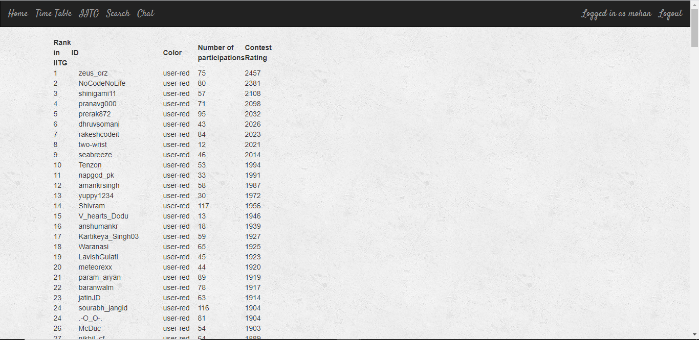
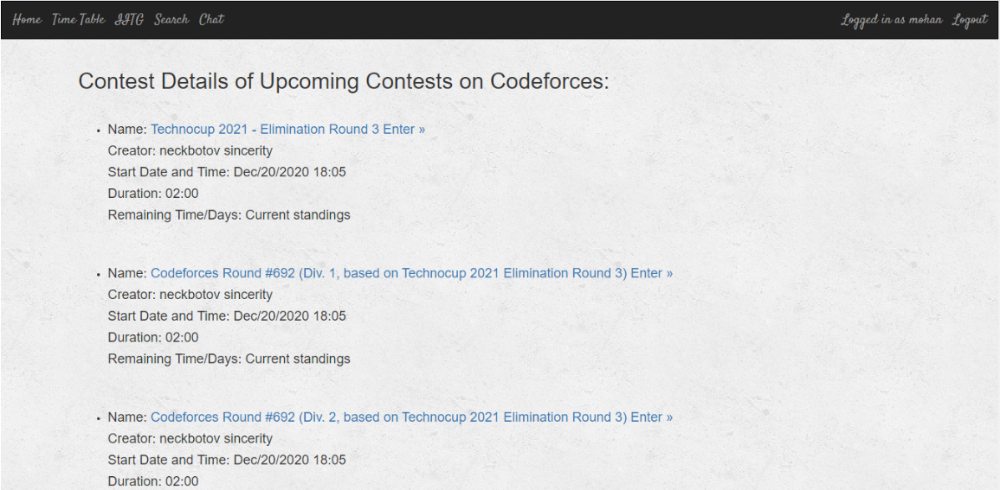
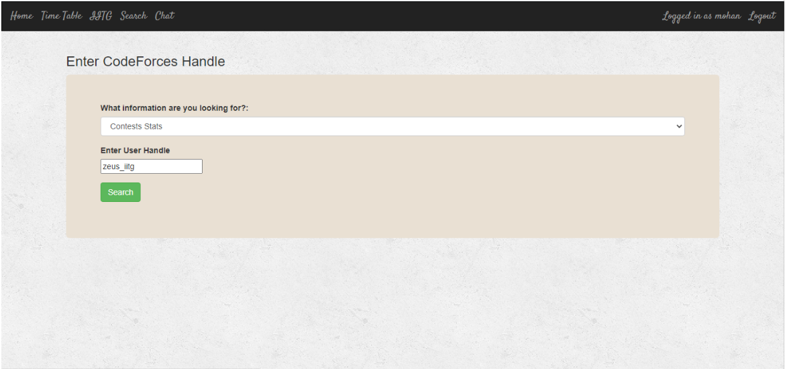
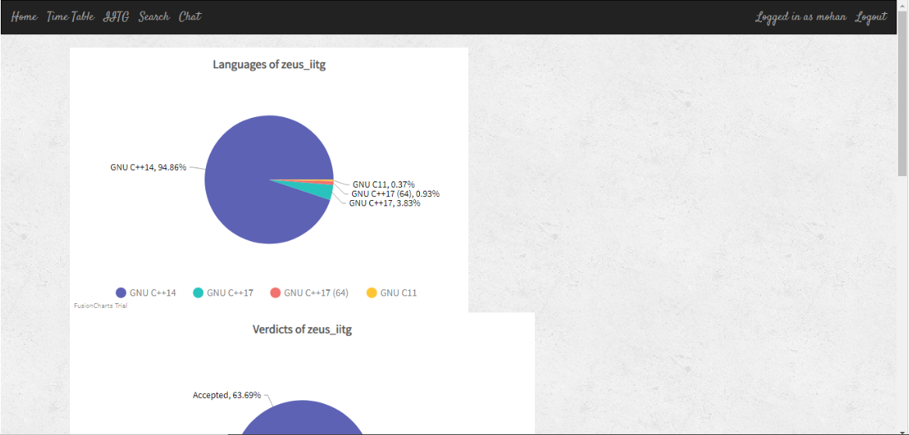
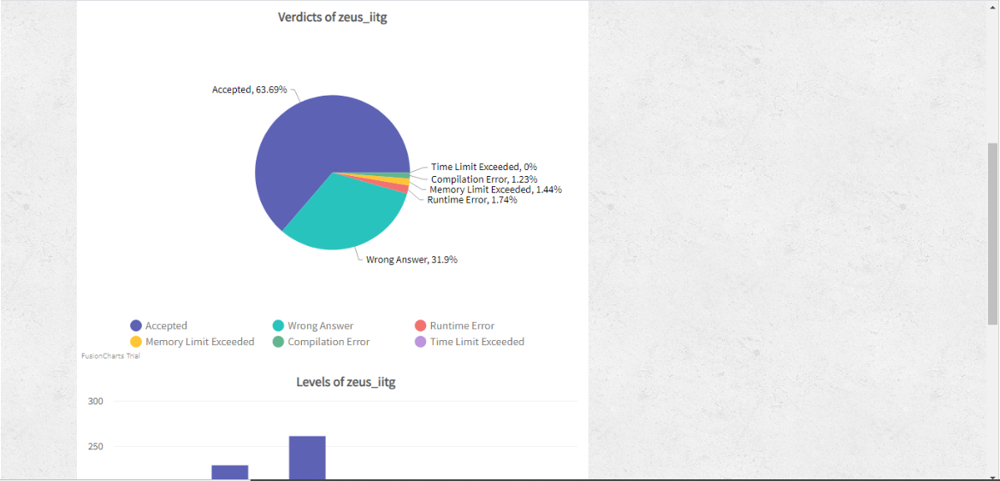
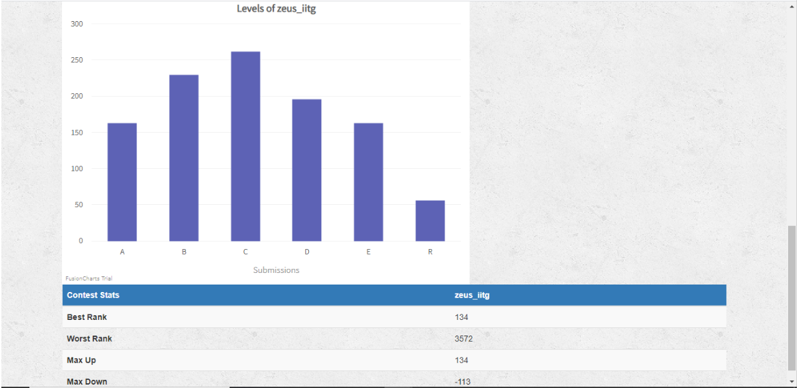
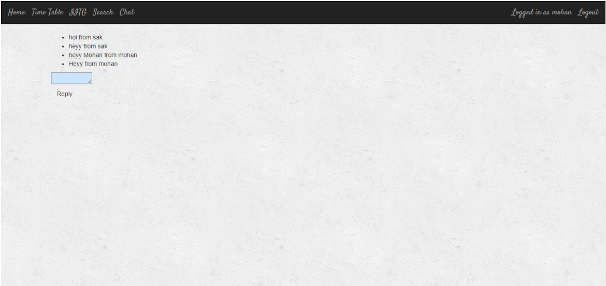

# Codeforces-Crawler #
It is a Django based website that scrapes information from Codeforces website using Beautiful Soup. It uses PostgreSQL as the backend database. The following are the key features of this project:
* User registration, login, and logout.
* Get contest details of upcoming contests. 
* Get the leaderboard for coders from my college, Indian Institute of Technology, Guwahati.
* Get information about a user like their name, rating, college’s name, color, title etc.
* Get information about stats of the submissions made by a user like languages used, verdicts and the level of problem attempted. It also shows them pictorially, pie charts for languages and verdicts and bar graph for levels of problem.
* Chat among users with all the message history getting saved in the database.

## Check it out! ##
Check it out [here](https://codeforces-crawler.herokuapp.com/) !

## Tech Stack ##
* Frontend: HTML/CSS
* Backend: Django
* Database : PostgreSQL

## How to run locally? ##
* Clone the repo.
    * git clone https://github.com/sakshi-s/Codeforces-Crawler.git
* Create virtual environment.
    * python -m venv env
    * env\Scripts\activate
    * This will create env folder.
* Install dependencies.
    * pip install -r requirements.txt
* Change Directory.
    * cd CodeforcesCrawler
* Update the password for your 'postgres' superuser in settings.py. Then make migrations.
    * python manage.py makemigrations
* Migrate database.
    * python manage.py migrate
* Create a superuser.
    * python manage.py createsuperuser
* Run server.
    * python manage.py runserver
    * Server starts at 'http://127.0.0.1:8000/'
    
## Snapshots ##

## Future plans ##
* Get information for other coding platforms like CodeChef, Leetcode etc.
* Explore some APIs that may be present for these purposes as scraping tends to be slow.
* Use Multiprocessing Pool python library to improve speed.
* Implement Google, Outlook or GitHub account based authentication.
